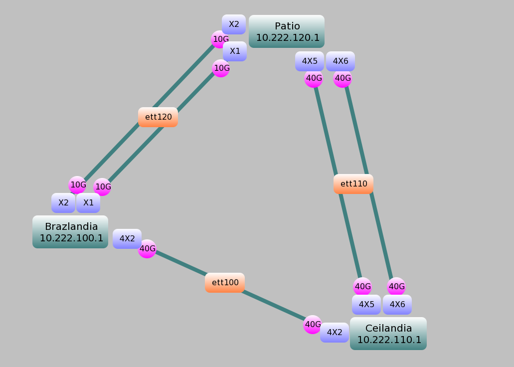

# Anel MPLS

Este anel MPLS percorrerá 3 POPs e o circuito específico MPLS se dará conforme a topologia:

|Nome       |Modelo             |Firmware
|-----------|-------------------|-
|Brazlandia |S6720-50L-HI-48S   |
|Ceilandia  |S6730-S24X6Q       |
|Patio      |S6730-S24X6Q       |